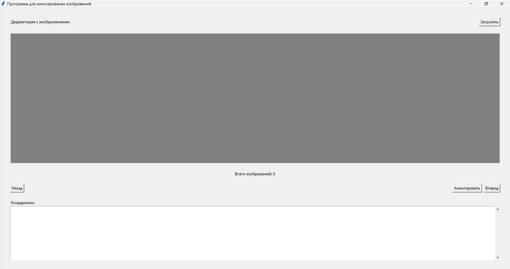

# Проект: Anno

Добро пожаловать в репозиторий **Anno**! Этот проект представляет собой [описание вашей программы - например, инструмент для анализа данных, управления задачами и т.д.]. Мы рады, что вы здесь и надеемся, что наш инструмент будет полезен для вас.

## Описание

**Anno** - это [краткое описание функционала программы]. Она позволяет пользователям [ключевые функции и возможности программы]. Наша цель - упростить [описание задачи или проблемы, которую решает программа] и предоставить удобный инструмент для [целевой аудитории программы].

## Скриншоты

Вот как выглядит наша программа:

## Установка и использование

Для установки и использования программы выполните следующие шаги:

1. Скачайте последнюю версию программы с Яндекс.Диск:
   [Ссылка на скачивание](https://disk.yandex.ru/d/jMvP6xAjL9KkSg)

2. [Инструкции по установке и запуску программы, если необходимо]

## Вклад

Мы приветствуем вклад от сообщества! Если у вас есть идеи, баг-репорты или предложения по улучшению, пожалуйста, создайте Issue или Pull Request. Мы рады любому вкладу в развитие проекта.

## Лицензия

Этот проект лицензирован на условиях лицензии [название лицензии]. Более подробную информацию можно найти в файле `LICENSE`.

---

Если у вас есть вопросы или вам нужна помощь, не стесняйтесь обращаться к нам. Спасибо за использование **Anno**!
